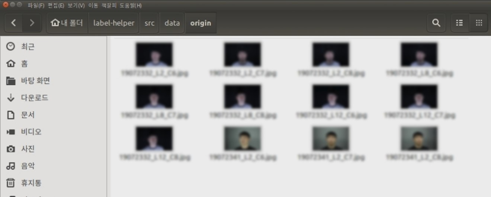
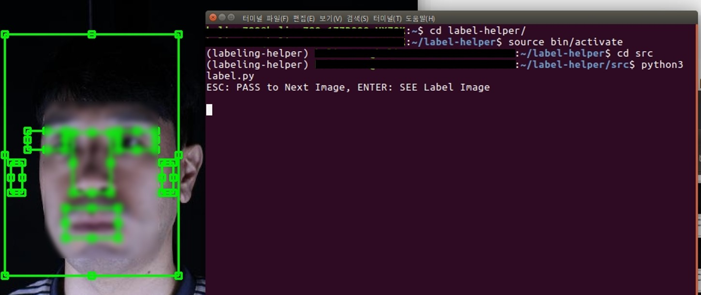

## label-helper

---

얼굴 인식 데이터셋 제작을 조금 더 빠르고 쉽고 가볍게!


### Directory

---

```
label-helper
--/src
	|--/data
		|--/label
			|--/image
			|--/json
		|--/origin
```


### Usage

---

1. #### 파이썬 가상환경(venv) 및 필요한 라이브러리 설치

   Python 3.5, OpenCV, 파이썬 Virtualenv 기준으로 개발되었습니다.

   ```
   $ pip3 install -r requirements.txt	# 의존성 라이브러리 설치
   $ source ./bin/active	# 파이썬 가상환경 실행
   ```


2. #### 레이블링을 진행할 데이터 불러오기



​	`/src/data/origin` 폴더에 레이블링을 진행할 원본 이미지를 넣어주세요.


3. #### label.py 실행 후 레이블링 진행

   ```
   $ source ./bin/active	# 가상환경 실행
   $ cd ./src
   $ python3 label.py	# 레이블링 실행
   ```

   

   - 사각형을 드래그 하여 움직일 수 있습니다
   - 사각형의 가장자리를 드래그 하여 사각형의 크기를 자유롭게 조절할 수 있습니다
     

   사각형의 위치와 크기를 적절히 조절한 후 `Enter` 를 누르면 레이블링 결과를 확인할 수 있습니다

   그 후 다시 `Enter` 를 누르면 `/src/data/label/image` 폴더에 `레이블링 된 이미지`가, `/src/data/label/json` 폴더에 `.json` 형식의 레이블링 데이터가 저장됩니다


4. #### 레이블링 완료된 데이터 확인

   ```
   $ python3 json2image.py
   ```

   `/src/json2image.py` 를 실행하면, 레이블링이 완료된 json 파일을 기반으로 레이블링 완료 이미지를 생성하여 보여줍니다.